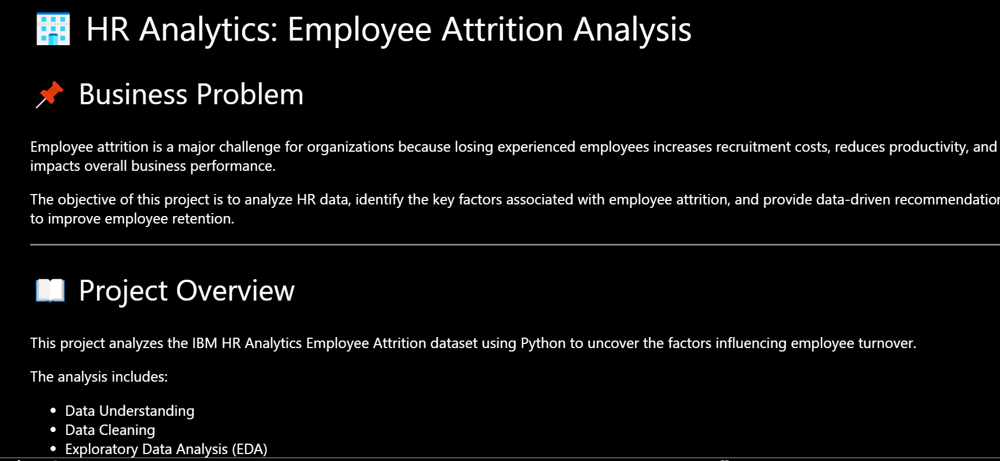
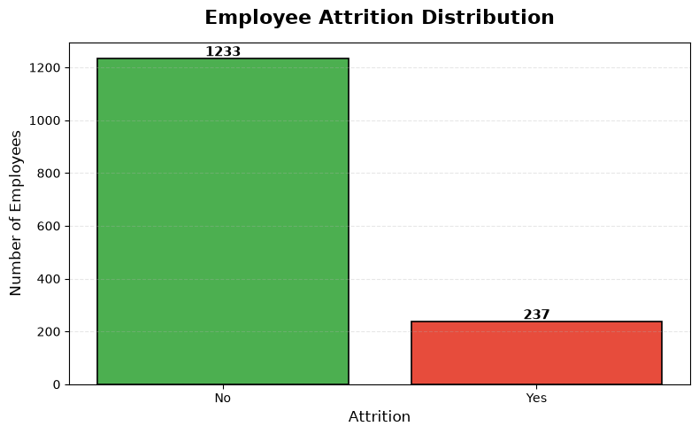
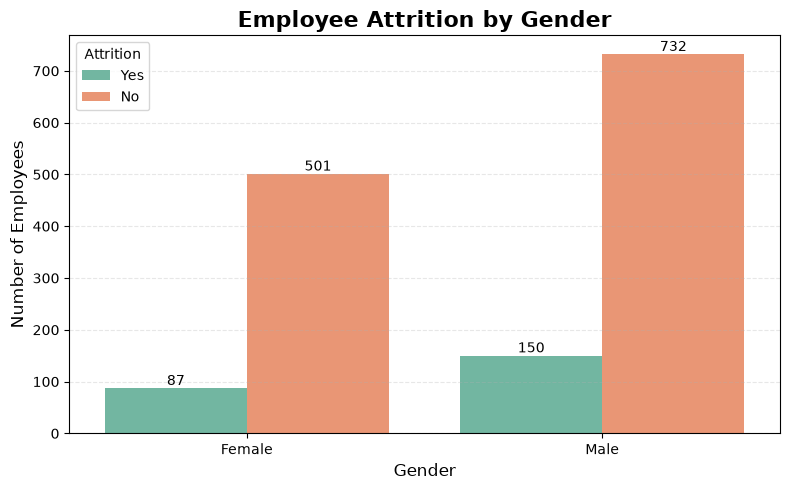
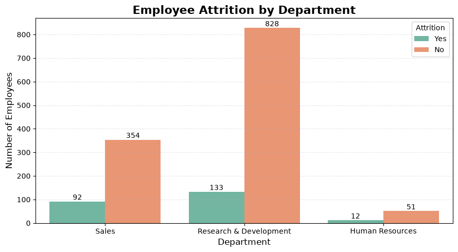
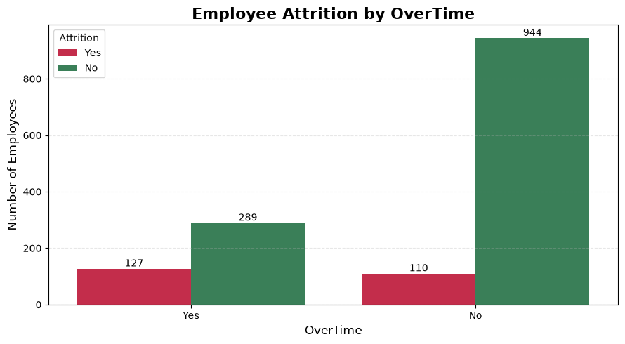
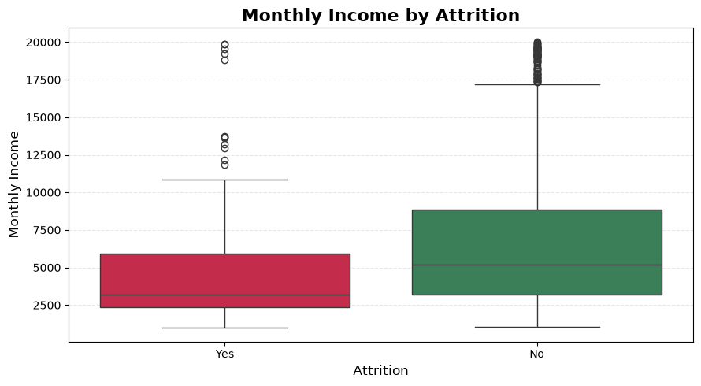
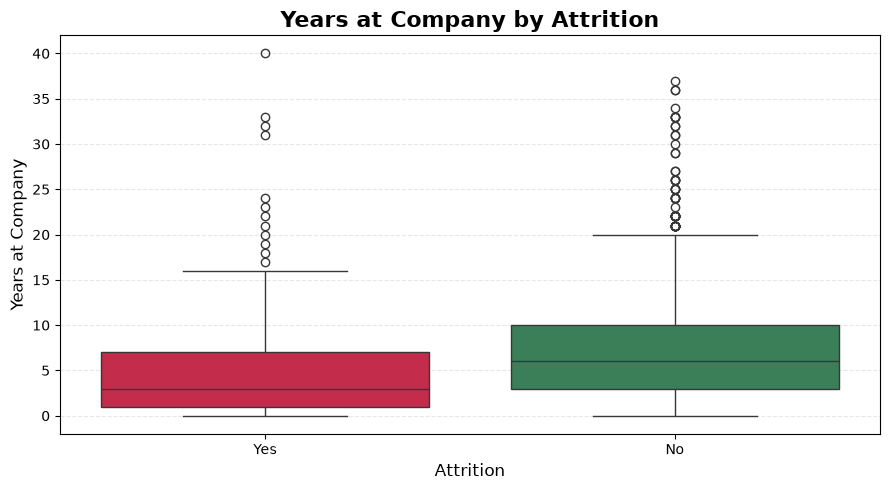
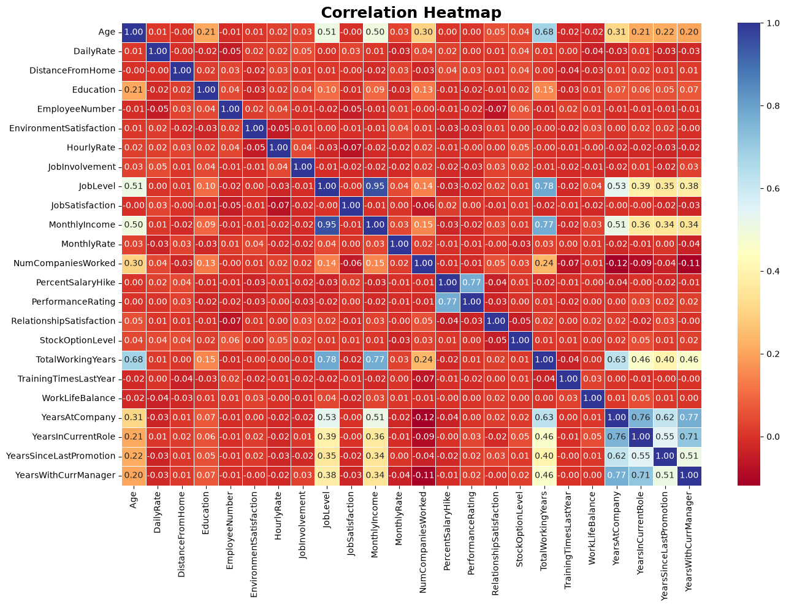
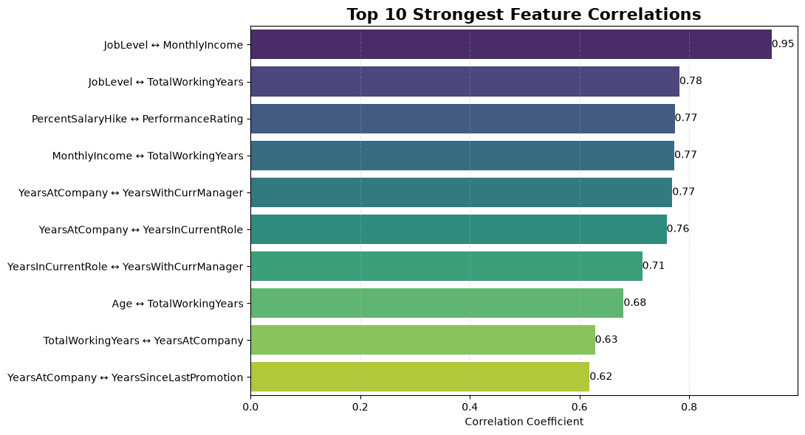

# 🏢 HR Analytics: Employee Attrition Analysis with Python

<p align="center">


</p>

---

## 📌 Project Overview

Employee attrition is one of the most important challenges facing Human Resources (HR) departments. High employee turnover leads to increased recruitment costs, productivity loss, knowledge gaps, and reduced organizational performance.

This project analyzes the **IBM HR Analytics Employee Attrition Dataset** using Python to explore the key factors associated with employee turnover. The analysis follows a complete data analytics workflow, beginning with data understanding and cleaning, followed by exploratory data analysis (EDA), KPI reporting, business insights, and actionable recommendations.

The project demonstrates practical data analysis skills using **Pandas**, **NumPy**, **Matplotlib**, and **Seaborn**, while emphasizing business storytelling and data-driven decision-making rather than visualization alone.

---

## 📸 Project Preview


```

---

## 📑 Table of Contents

- [📌 Project Overview](#-project-overview)
- [🎯 Business Problem](#-business-problem)
- [🎯 Project Objectives](#-project-objectives)
- [📂 Dataset Information](#-dataset-information)
- [🛠️ Technologies Used](#️-technologies-used)
- [📊 Project Workflow](#-project-workflow)
- [📈 Exploratory Data Analysis](#-exploratory-data-analysis)
- [📊 KPI Analysis](#-kpi-analysis)
- [📌 Key Findings](#-key-findings)
- [💡 Business Recommendations](#-business-recommendations)
- [🎯 Skills Demonstrated](#-skills-demonstrated)
- [📂 Project Structure](#-project-structure)
- [🚀 How to Run](#-how-to-run)
- [🔮 Future Improvements](#-future-improvements)
- [📄 License](#-license)

--------
# 🎯 Business Problem

Employee attrition is a critical challenge for organizations because replacing experienced employees requires significant time, effort, and financial resources. High turnover not only increases recruitment and training costs but also affects productivity, team stability, employee morale, and overall business performance.

Human Resources (HR) departments rely on data analytics to identify the factors associated with employee attrition, understand workforce behavior, and develop strategies that improve employee retention.

This project investigates employee attrition using the IBM HR Analytics dataset to answer important business questions such as:

- Which employees are more likely to leave the company?
- Does overtime increase employee attrition?
- Which department experiences the highest turnover?
- Is employee income associated with attrition?
- Does employee tenure influence retention?
- What actionable recommendations can HR managers implement to reduce attrition?

---

# 🎯 Project Objectives

The primary objective of this project is to perform an end-to-end exploratory analysis of employee attrition and transform raw HR data into meaningful business insights.

The analysis focuses on:

- Understanding the structure and quality of the dataset.
- Cleaning and preparing the data for analysis.
- Exploring employee demographics and workforce characteristics.
- Identifying patterns associated with employee attrition.
- Measuring important HR KPIs.
- Visualizing relationships between key variables.
- Generating business insights based on analytical findings.
- Providing practical recommendations to improve employee retention.

---

# 📂 Dataset Information

| Item | Details |
|------|---------|
| Dataset | IBM HR Analytics Employee Attrition & Performance |
| Source | IBM Sample Dataset |
| Domain | Human Resources (HR Analytics) |
| Records | 1,470 Employees |
| Features | 35 Columns |
| Missing Values | None |
| Duplicate Records | None |
| Target Variable | Attrition |

The dataset contains employee demographic information, job-related characteristics, compensation details, satisfaction scores, work-life balance indicators, and other HR attributes that can be analyzed to understand employee turnover.

---

# ❓ Business Questions Answered

Throughout this project, the following questions are addressed:

- What is the overall employee attrition rate?
- Which gender has a higher attrition rate?
- Which department experiences the highest employee turnover?
- Does overtime significantly affect attrition?
- How does monthly income relate to employee attrition?
- Are employees with shorter tenure more likely to leave?
- Which numerical features are strongly correlated?
- What business actions can improve employee retention?

-------
# 🛠️ Technologies Used

The project was developed using the following technologies and tools:

| Category | Technology |
|----------|------------|
| Programming Language | Python 3 |
| Development Environment | Jupyter Notebook |
| Data Manipulation | Pandas |
| Numerical Computing | NumPy |
| Data Visualization | Matplotlib |
| Statistical Visualization | Seaborn |
| Version Control | Git & GitHub |

---

# 📚 Python Libraries

The following Python libraries were used throughout the project:

| Library | Purpose |
|----------|---------|
| **Pandas** | Data loading, cleaning, transformation, and analysis |
| **NumPy** | Numerical operations and array manipulation |
| **Matplotlib** | Creating static data visualizations |
| **Seaborn** | Building statistical charts and advanced visualizations |

---

# 🎯 Skills Demonstrated

This project demonstrates the following data analytics skills:

### 📂 Data Preparation

- Importing datasets
- Data inspection
- Handling duplicate records
- Identifying constant columns
- Data cleaning
- Data validation

---

### 📊 Exploratory Data Analysis (EDA)

- Univariate Analysis
- Bivariate Analysis
- Distribution Analysis
- Correlation Analysis
- Statistical Summaries
- Pattern Identification

---

### 📈 Data Visualization

The project includes multiple visualization techniques, including:

- Count Plots
- Bar Charts
- Box Plots
- Histograms
- Correlation Heatmaps
- Correlation Ranking Charts

---

### 📊 KPI Reporting

Key HR metrics were calculated, including:

- Total Employees
- Employees Left
- Employees Stayed
- Attrition Rate
- Average Age
- Average Monthly Income
- Average Years at Company
- Average Job Satisfaction
- Average Work-Life Balance

---

### 💼 Business Analytics

The analysis focuses on transforming data into business value by:

- Identifying employee attrition patterns
- Measuring HR performance indicators
- Discovering workforce trends
- Supporting HR decision-making
- Generating business insights
- Providing actionable recommendations

---

# 🎯 Project Deliverables

The final project includes:

- ✅ Clean and well-documented Jupyter Notebook
- ✅ Exploratory Data Analysis (EDA)
- ✅ HR KPI Analysis
- ✅ Business Insights
- ✅ Actionable Recommendations
- ✅ High-quality visualizations
- ✅ Organized project structure
- ✅ Professional GitHub documentation

------
# 📊 Project Workflow

The project follows a complete end-to-end data analytics workflow, transforming raw HR data into meaningful business insights and actionable recommendations.

```text
                 IBM HR Analytics Dataset
                           │
                           ▼
                🔍 Data Understanding
                           │
                           ▼
                 🧹 Data Cleaning
                           │
                           ▼
          📊 Exploratory Data Analysis
                           │
                           ▼
                 📈 KPI Analysis
                           │
                           ▼
              📌 Business Insights
                           │
                           ▼
              💡 Business Recommendations
                           │
                           ▼
                  ✅ Conclusion
```

---

## 🔍 1. Data Understanding

The analysis begins with an initial exploration of the dataset to understand its overall structure and quality.

Tasks performed:

- Dataset Shape
- Dataset Information
- Summary Statistics
- Column Inspection
- Missing Values Analysis
- Duplicate Detection
- Initial Data Assessment

---

## 🧹 2. Data Cleaning

The dataset was examined to ensure data quality before performing any analysis.

Cleaning steps included:

- Identifying constant-value columns
- Removing unnecessary columns
- Verifying dataset integrity
- Preparing a clean dataset for analysis

---

## 📊 3. Exploratory Data Analysis (EDA)

Exploratory Data Analysis was conducted to identify trends, distributions, and relationships within the HR dataset.

The analysis covered:

### Employee Attrition

- Overall Attrition Distribution
- Attrition by Gender
- Attrition by Department
- Attrition by OverTime

### Employee Characteristics

- Monthly Income vs Attrition
- Years at Company vs Attrition

### Feature Relationships

- Correlation Heatmap
- Top Positive Correlations

Each visualization includes business interpretation and analytical insights.

---

## 📈 4. KPI Analysis

Key Human Resources metrics were calculated to summarize workforce performance.

KPIs include:

- Total Employees
- Employees Left
- Employees Stayed
- Attrition Rate
- Average Age
- Average Monthly Income
- Average Years at Company
- Average Job Satisfaction
- Average Work-Life Balance

---

## 📌 5. Business Insights

The analytical findings were translated into business-oriented insights to support HR decision-making.

The project identifies:

- Workforce turnover patterns
- High-risk employee groups
- Department-level differences
- Overtime impact
- Salary-related trends
- Employee retention indicators

---

## 💡 6. Business Recommendations

Based on the analysis, practical recommendations were proposed to improve employee retention.

Recommendations focus on:

- Reducing excessive overtime
- Improving retention strategies
- Reviewing compensation policies
- Supporting new employees
- Monitoring HR KPIs continuously

---

## ✅ 7. Conclusion

The project concludes by summarizing the analytical findings and demonstrating how data-driven insights can help HR departments improve employee retention and workforce planning.

--------
# 📈 Exploratory Data Analysis

The Exploratory Data Analysis (EDA) phase was conducted to understand workforce characteristics, identify attrition patterns, and uncover relationships between employee attributes.

The analysis combines statistical summaries with visualizations to transform raw HR data into meaningful business insights.

---

## 📊 Employee Attrition Distribution

This visualization provides an overview of employee turnover within the organization.



### Insight

- Most employees remain with the company.
- Approximately **16%** of employees left the organization.
- Although the overall attrition rate is relatively low, employee turnover still represents a significant business concern because replacing experienced employees is both costly and time-consuming.

---

## 👨‍💼 Employee Attrition by Gender

This chart compares employee attrition across genders.



### Insight

- Male employees exhibit a slightly higher attrition rate than female employees.
- However, the difference is relatively small, suggesting that gender alone is not a strong predictor of employee turnover.

---

## 🏢 Employee Attrition by Department

This analysis compares attrition across organizational departments.



### Insight

- The **Sales** department experiences the highest employee attrition.
- Research & Development has the largest workforce while maintaining a lower attrition rate.
- HR managers should prioritize retention strategies within the Sales department.

---

## ⏰ Employee Attrition by OverTime

This visualization explores the relationship between overtime and employee attrition.



### Insight

- Employees working overtime experience a substantially higher attrition rate.
- Overtime appears to be one of the strongest factors associated with employee turnover.
- Managing employee workload may significantly improve retention.

---

## 💰 Monthly Income vs Attrition

A box plot comparing salary distributions between employees who stayed and those who left.



### Insight

- Employees who left the company generally have lower monthly incomes.
- Higher-income employees tend to remain with the organization.
- Compensation may play an important role in employee retention.

---

## 📅 Years at Company vs Attrition

This analysis compares employee tenure between employees who stayed and employees who left.



### Insight

- Employees who left typically have fewer years of service.
- Employee turnover appears more common during the early stages of employment.

---

## 🔥 Correlation Analysis

The correlation heatmap illustrates relationships among numerical variables.



To improve readability, the strongest positive relationships are summarized below.



### Insight

- **Job Level** and **Monthly Income** exhibit the strongest positive correlation.
- Employee tenure is strongly associated with years in the current role and years with the current manager.
- Most remaining numerical variables display weak or moderate relationships, indicating that employee attrition is influenced by multiple interacting factors rather than a single variable.

-------

# 📌 Executive Summary

The analysis reveals several important factors associated with employee attrition. Although the overall attrition rate remains relatively moderate, clear patterns emerge when examining overtime, department, employee tenure, and compensation.

The findings indicate that employee turnover is influenced by multiple workforce characteristics rather than a single factor. By understanding these patterns, HR teams can develop more effective retention strategies and improve workforce planning.

---

# 📊 Key Findings

## Workforce Overview

- The dataset contains **1,470 employees** across multiple departments and job roles.
- The overall employee attrition rate is approximately **16%**, indicating that roughly one out of every six employees left the company.

---

## Department Analysis

- The **Sales** department experiences the highest employee attrition rate.
- Research & Development has the largest workforce but maintains a comparatively lower attrition rate.
- Department-specific retention strategies are likely to be more effective than company-wide initiatives.

---

## Overtime

- Employees who work overtime leave the company at a significantly higher rate than employees who do not.
- Overtime appears to be one of the strongest indicators associated with employee turnover.

---

## Compensation

- Employees who left the company generally earned lower monthly salaries.
- Compensation may contribute to employee retention, particularly for lower-income groups.

---

## Employee Tenure

- Employees with fewer years at the company appear more likely to leave.
- Early-stage employee engagement and onboarding programs may improve long-term retention.

---

## Correlation Analysis

- Job Level and Monthly Income exhibit the strongest positive relationship.
- Years at Company is highly correlated with Years in Current Role and Years with Current Manager.
- Most remaining numerical variables demonstrate weak to moderate relationships, suggesting that employee attrition is influenced by multiple interacting factors.

---

# 💡 Business Recommendations

Based on the analytical findings, the following actions are recommended:

### 1. Improve Workload Management

Reduce excessive overtime by balancing workloads and monitoring employee well-being.

---

### 2. Focus on High-Risk Departments

Develop targeted retention strategies for departments experiencing higher attrition, particularly Sales.

---

### 3. Review Compensation Policies

Evaluate salary structures for lower-paid employees to improve competitiveness and employee satisfaction.

---

### 4. Strengthen Employee Onboarding

Provide additional support during employees' first years within the company to improve long-term retention.

---

### 5. Monitor HR KPIs

Track key HR metrics regularly through dashboards to identify workforce trends before they become critical.

---

### 6. Continue Data-Driven Decision Making

Use workforce analytics as part of HR planning to continuously evaluate employee satisfaction, turnover, and organizational performance.

------

# 🗂️ Project Architecture

The project is organized into several logical sections, following a complete end-to-end data analytics workflow.

```text
🏢 HR Analytics: Employee Attrition Analysis
│
├── 📖 Project Overview
│   ├── Business Problem
│   ├── Project Objectives
│   └── Dataset Information
│
├── 🛠 Technologies & Libraries
│   ├── Python
│   ├── Pandas
│   ├── NumPy
│   ├── Matplotlib
│   ├── Seaborn
│   └── Jupyter Notebook
│
├── 📊 Data Analytics Workflow
│   │
│   ├── 🔍 Data Understanding
│   │   ├── Dataset Shape
│   │   ├── Dataset Information
│   │   ├── Summary Statistics
│   │   ├── Column Names
│   │   ├── Missing Values
│   │   ├── Duplicate Records
│   │   └── Data Understanding Summary
│   │
│   ├── 🧹 Data Cleaning
│   │   ├── Constant Columns Detection
│   │   ├── Remove Constant Columns
│   │   └── Data Validation
│   │
│   ├── 📈 Exploratory Data Analysis (EDA)
│   │   ├── Employee Attrition Distribution
│   │   ├── Attrition by Gender
│   │   ├── Attrition Rate by Gender
│   │   ├── Attrition by Department
│   │   ├── Attrition Rate by Department
│   │   ├── Attrition by OverTime
│   │   ├── Attrition Rate by OverTime
│   │   ├── Monthly Income vs Attrition
│   │   ├── Years at Company vs Attrition
│   │   ├── Correlation Heatmap
│   │   ├── Top Positive Correlations
│   │   └── EDA Summary
│   │
│   ├── 📊 KPI Analysis
│   │   ├── Workforce KPIs
│   │   └── Employee Statistics
│   │
│   ├── 📌 Business Insights
│   │
│   ├── 💡 Recommendations
│   │
│   └── ✅ Conclusion
│
└── 📂 Project Files
    ├── Dataset
    ├── Images
    ├── Notebook
    ├── README
    ├── requirements.txt
    ├── LICENSE
    └── .gitignore
```

--------
# 🚀 Installation & Usage

Follow these steps to run the project locally.

## 1️⃣ Clone the Repository

```bash
git clone https://github.com/97moro/HR-Analytics-Python.git
```

---

## 2️⃣ Navigate to the Project Folder

```bash
cd HR-Analytics-Python
```

---

## 3️⃣ Install Required Libraries

```bash
pip install -r requirements.txt
```

---

## 4️⃣ Launch Jupyter Notebook

```bash
jupyter notebook
```

Open:

```text
Notebook/
└── HR_Analytics.ipynb
```

Run the notebook from top to bottom to reproduce the complete analysis.

---

# 📦 Requirements

The project uses the following Python libraries:

| Library | Version |
|----------|---------|
| Python | 3.x |
| Pandas | Latest |
| NumPy | Latest |
| Matplotlib | Latest |
| Seaborn | Latest |
| Jupyter Notebook | Latest |

You can install all dependencies using:

```bash
pip install -r requirements.txt
```

---

# 📄 requirements.txt

```text
pandas
numpy
matplotlib
seaborn
jupyter
```

---

# 🖥 Environment

The project was developed and tested using:

| Component | Value |
|-----------|-------|
| Operating System | Windows |
| IDE | Jupyter Notebook |
| Language | Python |
| Version Control | Git & GitHub |

------
# 🔮 Future Improvements

Possible future enhancements include:

- Build an interactive HR dashboard using **Power BI**.
- Develop a machine learning model to predict employee attrition.
- Perform feature importance analysis.
- Create an HR analytics web application using **Streamlit**.
- Automate HR reporting with scheduled dashboards.
- Compare multiple HR datasets for benchmarking.
- Integrate SQL for data storage and querying.

-----

# 📌 Project Highlights

✅ End-to-End Data Analytics Project

✅ Data Cleaning & Validation

✅ Exploratory Data Analysis (EDA)

✅ KPI Reporting

✅ Statistical Visualization

✅ Correlation Analysis

✅ Business Storytelling

✅ Actionable Business Recommendations

✅ Professional Documentation

✅ GitHub Portfolio Ready

# 📄 License

This project is licensed under the **MIT License**.

Feel free to use, modify, and share this project for educational purposes.

---

# 👨‍💻 Author

**Ahmed Samir**

Aspiring Data Analyst passionate about transforming data into actionable business insights.

### Connect with me

- GitHub: https://github.com/97moro

---

## ⭐ If you found this project useful

Please consider giving the repository a **Star ⭐** to support the project.
